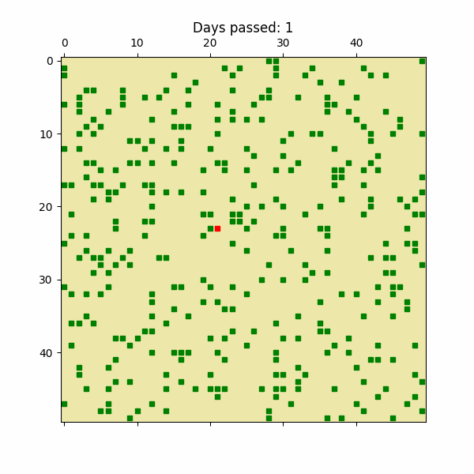
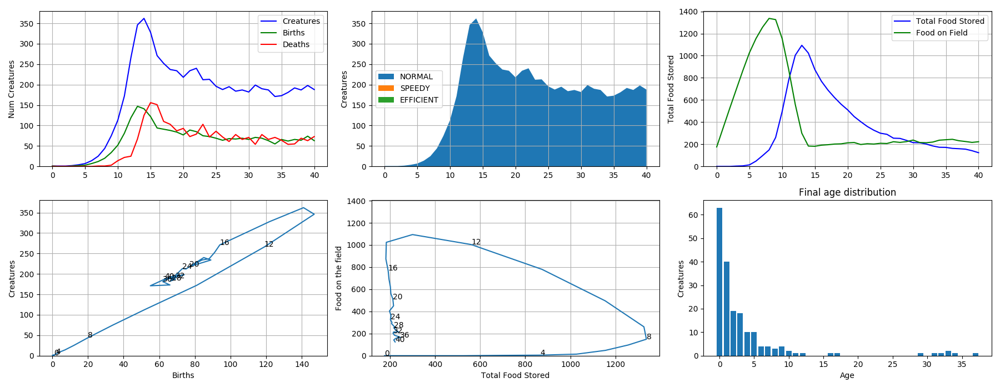

## Overview

This repository contains a framework for examining population dynamics and natural selection. The basic element of the framework is a world, which consists of a field and a set of creatures that occupy the field. Food is on the field (the field can sprout new food and food can spoil).  Time progresses in the world as follows:

1 day consists of 2 phases

1. The creatures roam around the field collecting food and storing it - they’ll take some number of steps (up, down, left, or right) depending on how fast they are and how long the day is.

2. At the end of the day a few things happen:

    a. Each creature must eat some amount of food.  If it hasn’t stored enough food, it dies.

    b. If, after eating, the creature has enough food, it will reproduce, creating another creature at it’s same location.  This new creature may mutate, changing its properties.

    c. The food throughout the world may spoil, and the field will resprout food.

## Instructions
Clone the package as usual.
```bash
git clone https://github.com/dustinmcintosh/world_wandering_dudes

cd world_wandering_dudes
```
Update the directory in SET_ME.py to your desired destination for figures.

Run the sample code:
```bash
python scripts.basic_simulation.py
```


## Example
The simulation results are random and strongly dependent on the properties of the world:


Looking over the course of many days:


We can also look at stats on the creatures/field throughout the world's history:

